# TouchDesigner 🖍️

En 1942 se invento el primer reactor nuclear, el chicago pile-1☢️. Desde entonces la historia no volvio a ser la misma.
Pero bueno hablemos de TD y de este repositorio, aca la lista de componentes .tox y sus funciones, sentate y disfruta de tus palomitas favoritas.🍿

## Componentes 🚀:

### `Desomarizador`

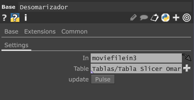

Este componente recibe un input  "Omarizado" como se muestra a continuacion:

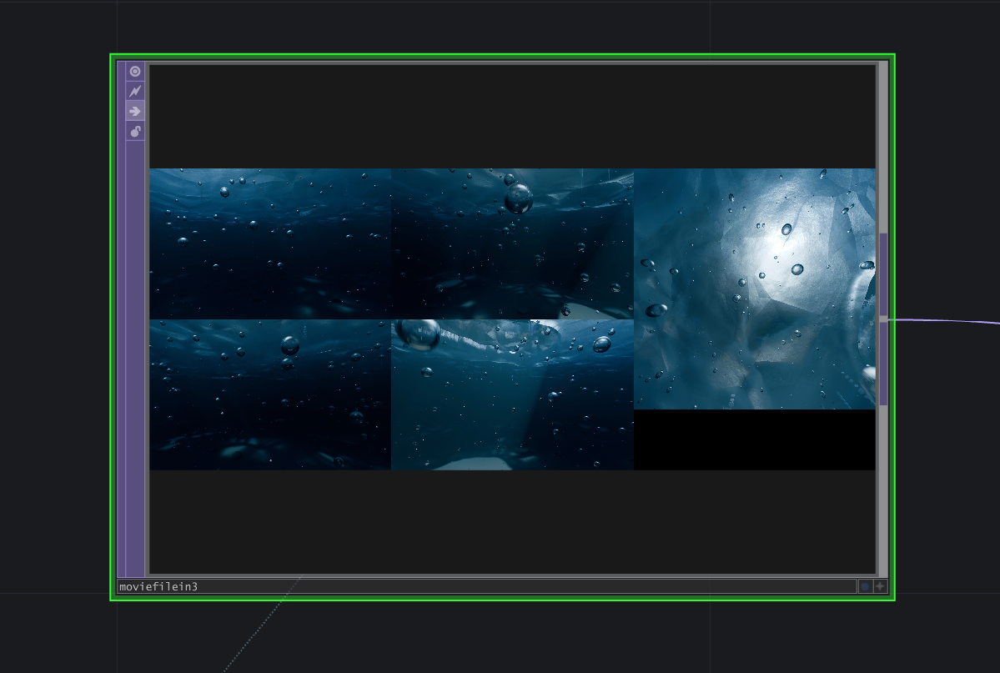

Para con base en una tabla use un replicator que "separa" el input en 5 outputs

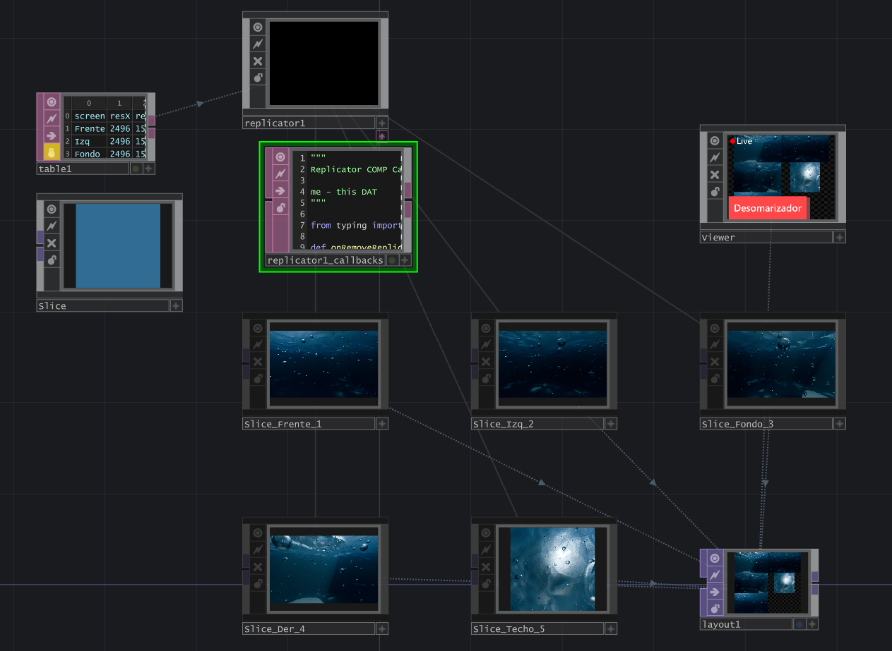

**(Layout y Viewer incluidos en la compra de cualquier componente 👍)**

### `Omarizador`

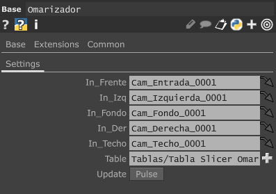

Este componente al reverso del "Desomarizador" recibe 5 inputs:

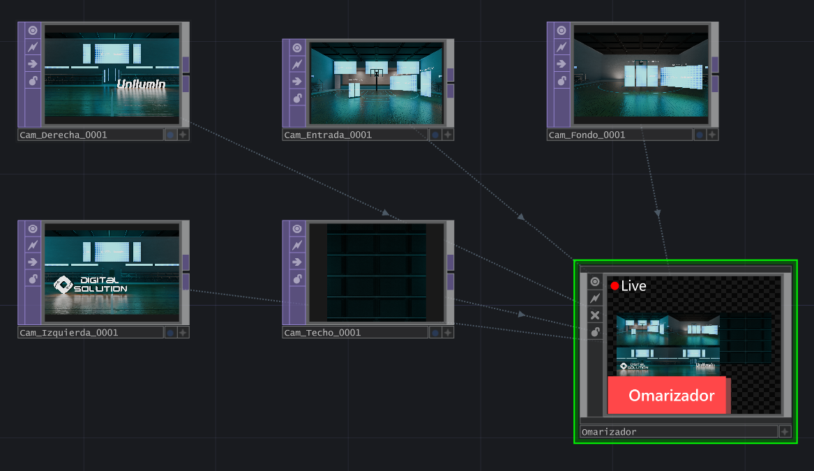

Y te regresa solo 1 output "Omarizado":

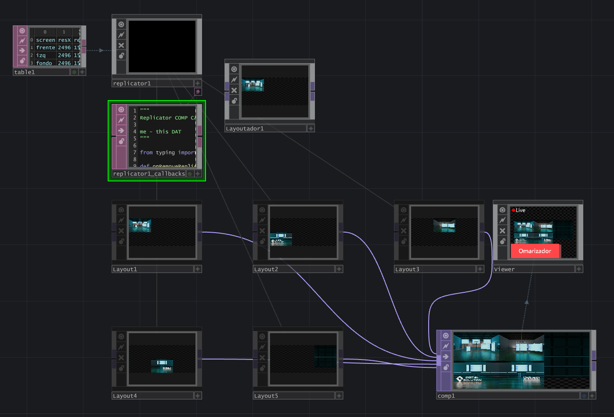

### `Rotador_2`

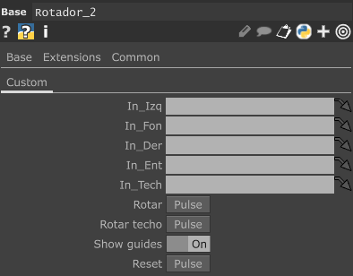

Este componente recibe los 5 inputs y te permite intercambiarlos entre outputs o "Rotarlos" 💫

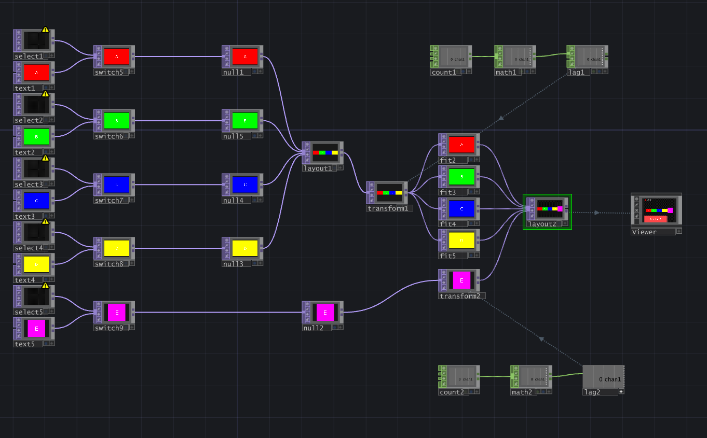

Este te permite ver la rotacion entre caras.

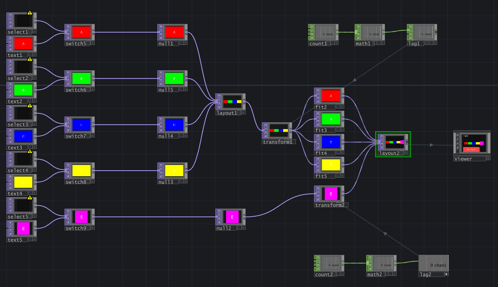

### `Siamesador`

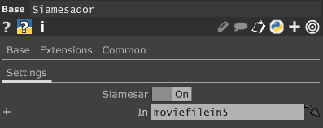

Recibe solo un input y te entrega 2 outputs duplicados y ajustados o mitad y mitad del contenido del input 🔪:
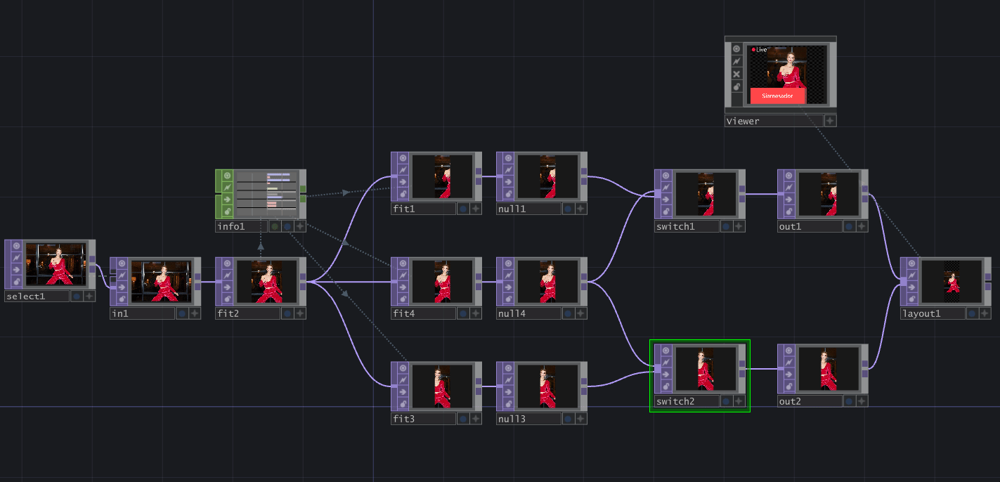

### `Sliceador_de_Tiras`

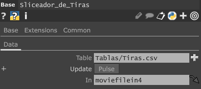

Recibe un input y lo ajusta con un replicador para entregarte 4 outputs en forma de tiras 

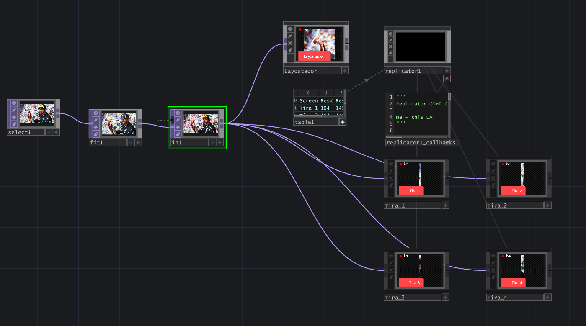

Por ultimo el proyecto Try  2.pie contiene todos estos componentes 👍

# By Manuzx 🖍️
